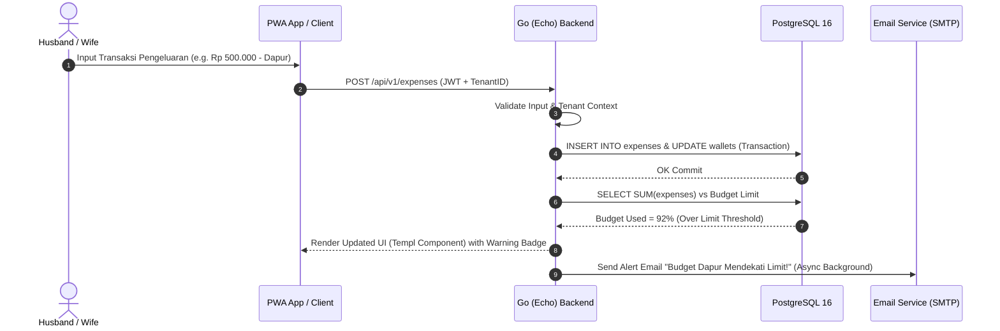
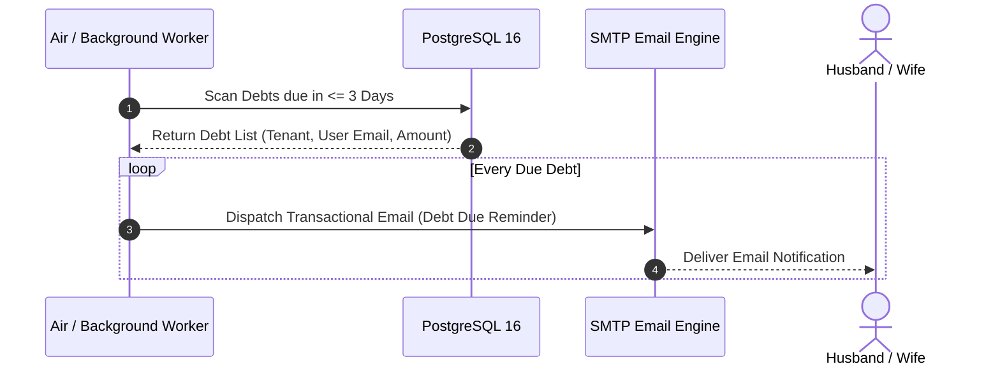

# Product Requirement Document (PRD) — Production Ready Specification
## JurnalUmi — Platform Management Keuangan Rumah Tangga & Multi-Tenant SaaS Keluarga

- **Dokumen Status:** Approved / Production-Ready Specification
- **Versi:** 2.0.0 (Enterprise / Multi-Tenant SaaS Standard)
- **Target OS & Infra:** Linux Fedora (Local Dev Podman Container) & Cloud VPS (Coolify Deployment)
- **Tech Stack Core:** Go 1.22+ | Echo Framework | Templ (Type-Safe HTML SSR) | Alpine.js (Lightweight UI Reactivity) | PostgreSQL 16 | Tailwind CSS v3/v4 | Air (Live Reload)

---

## 1. RINGKASAN EKSEKUTIF & VALUE PROPOSITION
**JurnalUmi** adalah platform SaaS manajemen keuangan rumah tangga yang dirancang untuk memberikan transparansi penuh atas kondisi finansial keluarga. Berbeda dengan aplikasi keuangan generik, JurnalUmi berfokus pada ketahanan finansial riil (*Net Worth & Liquidity Survival*) berbasis budaya dan prinsip keuangan rumah tangga modern serta syariah (pencatatan Emas/Dinar/Perak, zakat/infaq, utang-piutang, serta proteksi dana darurat keluarga).

---

## 2. SYSTEM ARCHITECTURE & SAAS DESIGN

### 2.1 High-Level Architecture Diagram (Mermaid)
```
[ Browser / Mobile PWA (Offline Sync / Cache) ]
                       │ (HTTP/2 / TLS)
                       ▼
             [ Reverse Proxy / Caddy ]
                       │
                       ▼
        ┌──────────────────────────────┐
        │  Go (Echo) SSR Application   │
        │ ┌──────────────────────────┐ │
        │ │  Templ Render Engine     │ │
        │ │  + Alpine.js Client-Side │ │
        │ └──────────────────────────┘ │
        │ ┌──────────────────────────┐ │
        │ │  Auth & Tenant Middleware│ │
        │ └──────────────────────────┘ │
        │ ┌──────────────────────────┐ │
        │ │  Services & Domain Logic │ │
        │ └──────────────────────────┘ │
        └──────────────┬───────────────┘
                       │
     ┌─────────────────┼─────────────────┐
     ▼                 ▼                 ▼
[PostgreSQL 16]   [SMTP / Email]    [Air / Dev Tool]
(DB Multi-Tenant)  (Transactional)   (Hot Reload)
```

### 2.2 Multi-Tenancy Architecture (Tenant Isolation)
- **Model Isolation:** *Discriminator Column Multi-Tenancy* dengan `tenant_id` (Family UUID) pada setiap tabel domain.
- **Enforcement:** Middleware otomatis menginjeksi `tenant_id` dari Session/JWT Context ke dalam klausa Query (GORM/SQLBuilder Engine).
- **Tenant Scope:** Setiap Keluarga (Family Account) memiliki ruang isolasi terpisah 100%. Data satu keluarga tidak akan pernah bocor ke keluarga lain.

---

## 3. USER ROLES & HAK AKSES (RBAC)

1. **Super Admin (Platform Owner)**
   - Mengelola Tenant/Keluarga (SaaS Billing, Activation, Suspension).
   - Melihat analitik platform global (MRR, Active Tenants, System Metrics).
   - Pengaturan variabel global (Harga Emas/Dinar/Perak Real-Time via API Provider).

2. **Family Owner / Kepala Keluarga (Husband/Primary Admin)**
   - Mengelola Akun Keluarga, menambah/menghapus Anggota Keluarga (Istri/Anak).
   - Mengatur Alokasi Anggaran Utama (Fixed Expenses, Sinking Funds, Emergency Fund Target).
   - Full Access: Input, Edit, Delete, Export, dan Pengaturan Utang/Piutang & Aset.

3. **Family Co-Owner / Pasangan (Spouse/Wife)**
   - Full Access input & edit transaksi harian (Pemasukan, Pengeluaran, Pos Belanja Dapur).
   - Mengelola dompet bersama & laporan belanja harian.
   - Hak akses setara untuk pencatatan aset bersama.

4. **Family Member (Child/Dependents)**
   - Akses terbatas: Hanya bisa mencatat pengeluaran uang saku pribadi / pos yang ditugaskan.
   - Tidak bisa melihat detail utang-piutang keluarga atau aset investasi utama.

5. **Auditor / Financial Planner (Read-Only Viewer)**
   - Akses Read-Only untuk konsultan keuangan keluarga / penasihat independen.

---

## 4. DETAILED DOMAIN MODULES & PRODUCTION FEATURES

### 4.1 Modul Pemasukan (Income Management)
- **Multi-Source Income:** Gaji Rutin, Bonus, Freelance, Hasil Usaha, Bagi Hasil, Dividen, Hasil Sewa.
- **Recurring Schedule:** Otomatisasi pendaftaran pemasukan rutin bulanan (Auto-Credit Log).
- **Alokasi Otomatis (Budget Allocation Engine):** Membagi Pemasukan ke Pos:
  - 50% Kebutuhan Rutin (Needs)
  - 30% Keinginan / Gaya Hidup (Wants)
  - 20% Tabungan / Investasi / Proteksi (Savings & Protection)

### 4.2 Modul Pengeluaran (Expense Management)
- **Hierarki Kategori Multi-Level:** Parent Category -> Sub Category.
- **Kategori Wajib (Fixed & Mandatory):** Dapur, Listrik, Air, SPP Anak, BPJS/Asuransi, Cicilan Rutin.
- **Kategori Sosial & Agama:** Zakat Maal, Zakat Fitrah, Infaq/Sedekah, Uang Orang Tua/Mertua.
- **Kategori Variable & Lifestyle:** Makan Luar, Rekreasi, Belanja Hobi, Langganan Digital.
- **Real-Time Budget Capping:** Peringatan visual (Warna Hijau <70%, Kuning 70-90%, Merah >90%) jika pengeluaran mendekati limit budget.

### 4.3 Modul Utang & Piutang (Debt & Receivable Engine)
- **Pencatatan Utang (Liabilities):**
  - KPR, Kredit Kendaraan, Kartu Kredit, Paylater, Utang Pribadi/Kerabat.
  - Tracking Parameter: Sisa Pokok, Bunga/Margin (%), Tanggal Jatuh Tempo Bulanan, Tenor Tersisa.
  - **Kalkulator Strategi Pelunasan Utang:**
    - *Snowball Method* (Pelunasan dari nominal terkecil).
    - *Avalanche Method* (Pelunasan dari bunga/margin tertinggi).
- **Pencatatan Piutang (Receivables):**
  - Daftar pihak yang meminjam uang keluarga, histori cicilan, & tombol *Send WA/Email Reminder*.

### 4.4 Modul Aset & Komoditas Logam Mulia (Net Worth & Assets)
- **Aset Likuid:** Kas Tunai, Bank (BCA, Mandiri, BRI, dll), E-Wallet (Gopay, OVO, ShopeePay, DANA).
- **Aset Logam Mulia (Gold & Precious Metals):**
  - **Pencatatan Emas Batangan (Gram):** Antam, UBS, Galeri24.
  - **Pencatatan Dinar & Perak (Dirham):** Jumlah keping, karatase, & bobot gram.
  - **Auto-Valuation Engine:** Integrasi API harga emas/perak harian untuk mengalkulasi nilai bersih dalam Rupiah secara otomatis.
- **Aset Investasi & Property:** Reksadana, Saham, Deposito, Surat Berharga Negara (SBN), Kendaraan, Properti/Tanah.
- **Net Worth Real-Time Dashboard:** `Total Seluruh Aset - Total Utang = Net Worth (Kekayaan Bersih Keluarga)`.

### 4.5 Modul Proteksi & Dana Darurat (Emergency Fund & Sinking Funds)
- **Emergency Fund Calculator & Health Score:**
  - Menghitung rasio kecukupan Dana Darurat berdasarkan status keluarga (Single: 6x, Menikah: 9x, Menikah + Anak: 12x pengeluaran bulanan).
  - Indikator Status: *Danger (0-3 Bln), Warning (3-6 Bln), Safe (>6 Bln)*.
- **Sinking Funds (Pos Dana Khusus Masa Depan):**
  - Pos Kurban, Tax Kendaraan, Mudik Lebaran, Biaya Masuk Sekolah, Liburan Keluarga.

### 4.6 Modul Interaktivitas Client-Side (Alpine.js Dynamic UI Engine)
- **Modal & Slide-Over Drawer:** Form tambah transaksi, pop-up rincian utang, dan dialog edit aset dikontrol secara deklaratif menggunakan `x-data`, `x-show`, dan `x-cloak`.
- **Dynamic Input Masking & Currency Formatter:** Format otomatis pemisah ribuan Rupiah (e.g. `10.000.000`) saat pengisian nominal via Alpine directives tanpa reload halaman.
- **Dynamic Field Duplication:** Menambah baris komoditas emas/dinar secara interaktif saat input massal.
- **Client-Side Filter & Live Search:** Filtering kategori pengeluaran dan pencarian cepat histori transaksi secara instan di browser.

---

## 5. SEQUENCE DIAGRAMS (WORKFLOW UTAMA)

### 5.1 Sequence: Pencatatan Transaksi & Auto-Calculations


### 5.2 Sequence: Pelunasan Utang & Notification Schedule


---

## 6. NOTIFIKASI EMAIL & PWA (OFFLINE & PROGRESSIVE)

### 6.1 System Notifikasi Email (SMTP Transactional Engine)
- **Providers Supported:** Resend / Mailgun / SMTP Relay / Mailhog (Local Dev).
- **Trigger Email Automations:**
  1. **Debt Due Reminder:** H-3 dan H-1 sebelum tanggal jatuh tempo utang/cicilan.
  2. **Budget Alert:** Email peringatan ketika pos pengeluaran menembus 80% dan 100%.
  3. **Monthly Financial Summary:** Laporan PDF bulanan otomatis terkirim setiap tanggal 1.
  4. **Emergency Fund Alert:** Peringatan jika saldo dana darurat terpakai.

### 6.2 PWA & Offline Capabilities (Progressive Web App)
- **Web App Manifest (`manifest.json`):** App Name, Custom Icons (192x192, 512x512), Theme Colors, Standalone Mode.
- **Service Worker (`sw.js`):**
  - **Network-First Strategy:** Untuk data finansial real-time.
  - **Cache-First Strategy:** Untuk static assets (CSS, JS, Fonts, Icons).
  - **Offline Form Queueing (IndexedDB):** Mengingat transaksi saat koneksi terputus dan melakukan auto-sync saat internet kembali terhubung.

---

## 7. SAAS SUBSCRIPTION & BILLING ARCHITECTURE

### 7.1 Tiering Plan SaaS & Pricing Model
1. **Paket Free Always (Selamanya Gratis - Dengan Limit):**
   - Rp 0 / bulan.
   - Limit: Max 1 Akun Dompet (Cash/Bank), Max 50 Transaksi/bulan, Max 1 User (Kepala Keluarga).
   - Akses: Fitur Pemasukan, Pengeluaran, & Ringkasan Sederhana. Tanpa Notifikasi Email & Tanpa Tracker Logam Mulia.
2. **Paket Premium Household (Akses Penuh Tanpa Batas):**
   - **Harga:** Rp 39.000 / bulan (atau Rp 390.000 / tahun).
   - Features: Unlimited Wallets & Transactions, Multi-User Couple Sync (Suami + Istri), Emas/Dinar/Perak Real-time Valuation Engine, Debt Snowball Calculator, Sinking Funds & Emergency Fund Health Score, Email Reminders (SMTP), Backup & PDF Reports Export.

### 7.2 System Pembayaran & Aktivasi (Mayar.id + Voucher Generator Engine)
- **Opsi 1: Integrasi Mayar.id Payment Gateway:**
  - Direct Checkout Link via Mayar.id API / Payment Link.
  - Automasi Webhook Callback: Event `payment.success` otomatis mengubah `tenants.plan` dari `free` menjadi `premium` dan mengaktifkan masa berlaku 30 hari.
- **Opsi 2: Systems Voucher Code / Activation Key:**
  - Super Admin dapat generate Unique Voucher Code (misal: `JURNALUMI-39K-XXXXXX`).
  - Form Redemption Voucher di Dashboard Tenant untuk aktivasi instan tanpa kartu kredit/E-Wallet.

### 7.3 Spesifikasi Landing Page (Conversion-Focused)
- **Hero Section:** Headline emosional & solutif ("Bebaskan Keluarga dari Stress Keuangan & Utang"). Call-to-Action (CTA): *Coba Gratis Sekarang* / *Langganan Premium Rp 39rb*.
- **Feature Showcase:** Interactive Preview (Modul Emas/Dinar, Emergency Fund Health Bar, Debt Calculator).
- **Pricing Matrix:** Komparasi Gratis vs Premium Rp 39rb secara transparan.
- **Payment Modal:** Pop-up integrasi Mayar.id Checkout & Input Kode Voucher Aktivasi.

---

## 8. TIMELINE PENGEMBANGAN & ROADMAP PRODUCTION

| Fase | Milestones & Deliverables | Durasi Est. | Status |
|---|---|---|---|
| **Fase 1** | Setup Go (Echo) Boilerplate, Air, Templ, Docker/Podman PostgreSQL, Base DB Schema | Minggu 1 | Ready to Start |
| **Fase 2** | Auth, Tenant Middleware, RBAC (Owner/Spouse/Member), Account Management | Minggu 2 | Pending |
| **Fase 3** | Core Ledger: Income, Expense, Category Hierarchy, Wallet Transfer | Minggu 3 | Pending |
| **Fase 4** | Advanced Asset Engine: Gold/Dinar/Perak Tracker, Net Worth Calculator | Minggu 4 | Pending |
| **Fase 5** | Debt & Receivable Management, Snowball Calculator, Emergency Fund Engine | Minggu 5 | Pending |
| **Fase 6** | PWA Service Worker (Offline Support), Email Notif System (SMTP/Resend) | Minggu 6 | Pending |
| **Fase 7** | SaaS Billing (Midtrans/Stripe), PDF Export Engine, Production Hardening & Deployment | Minggu 7-8 | Pending |

---

## 9. DATABASE SCHEMA DESIGN (POSTGRESQL 16)

```sql
-- Multi-Tenant Family Accounts
CREATE TABLE tenants (
    id UUID PRIMARY KEY DEFAULT gen_random_uuid(),
    name VARCHAR(255) NOT NULL,
    plan VARCHAR(50) DEFAULT 'free',
    created_at TIMESTAMP WITH TIME ZONE DEFAULT NOW(),
    updated_at TIMESTAMP WITH TIME ZONE DEFAULT NOW()
);

-- Users
CREATE TABLE users (
    id UUID PRIMARY KEY DEFAULT gen_random_uuid(),
    tenant_id UUID REFERENCES tenants(id) ON DELETE CASCADE,
    name VARCHAR(255) NOT NULL,
    email VARCHAR(255) UNIQUE NOT NULL,
    password_hash VARCHAR(255) NOT NULL,
    role VARCHAR(50) NOT NULL DEFAULT 'member', -- owner, spouse, member, auditor
    created_at TIMESTAMP WITH TIME ZONE DEFAULT NOW(),
    updated_at TIMESTAMP WITH TIME ZONE DEFAULT NOW()
);

-- Wallets & Accounts
CREATE TABLE wallets (
    id UUID PRIMARY KEY DEFAULT gen_random_uuid(),
    tenant_id UUID REFERENCES tenants(id) ON DELETE CASCADE,
    name VARCHAR(255) NOT NULL, -- e.g., Cash, Bank BCA, E-Wallet Gopay
    type VARCHAR(50) NOT NULL, -- cash, bank, ewallet, investment
    balance NUMERIC(18, 2) DEFAULT 0.00,
    created_at TIMESTAMP WITH TIME ZONE DEFAULT NOW()
);

-- Commodity Assets (Emas, Dinar, Perak)
CREATE TABLE commodity_assets (
    id UUID PRIMARY KEY DEFAULT gen_random_uuid(),
    tenant_id UUID REFERENCES tenants(id) ON DELETE CASCADE,
    type VARCHAR(50) NOT NULL, -- gold_bar, dinar, dirham, silver
    name VARCHAR(255) NOT NULL, -- e.g., Antam 10g, Dinar 1/4
    weight_gram NUMERIC(10, 4) NOT NULL,
    karatage NUMERIC(5, 2) DEFAULT 24.00,
    buy_price NUMERIC(18, 2) NOT NULL,
    current_value NUMERIC(18, 2) DEFAULT 0.00,
    created_at TIMESTAMP WITH TIME ZONE DEFAULT NOW()
);

-- Debts & Receivables
CREATE TABLE debts (
    id UUID PRIMARY KEY DEFAULT gen_random_uuid(),
    tenant_id UUID REFERENCES tenants(id) ON DELETE CASCADE,
    type VARCHAR(50) NOT NULL, -- debt (utang), receivable (piutang)
    title VARCHAR(255) NOT NULL,
    counterparty VARCHAR(255) NOT NULL, -- Nama Pemberi Utang / Peminjam
    total_amount NUMERIC(18, 2) NOT NULL,
    remaining_amount NUMERIC(18, 2) NOT NULL,
    interest_rate NUMERIC(5, 2) DEFAULT 0.00,
    due_date DATE,
    status VARCHAR(50) DEFAULT 'active', -- active, paid, defaulted
    created_at TIMESTAMP WITH TIME ZONE DEFAULT NOW()
);

-- Transactions (Income / Expense / Transfer)
CREATE TABLE transactions (
    id UUID PRIMARY KEY DEFAULT gen_random_uuid(),
    tenant_id UUID REFERENCES tenants(id) ON DELETE CASCADE,
    user_id UUID REFERENCES users(id) ON DELETE SET NULL,
    wallet_id UUID REFERENCES wallets(id) ON DELETE CASCADE,
    type VARCHAR(50) NOT NULL, -- income, expense, transfer
    category VARCHAR(100) NOT NULL,
    amount NUMERIC(18, 2) NOT NULL,
    description TEXT,
    transaction_date TIMESTAMP WITH TIME ZONE DEFAULT NOW(),
    created_at TIMESTAMP WITH TIME ZONE DEFAULT NOW()
);
```

---
*Dokumen PRD Production-Ready ini mengunci standar kualitas teknis JurnalUmi untuk dikembangkan menggunakan Go + Echo + Templ + PostgreSQL.*
